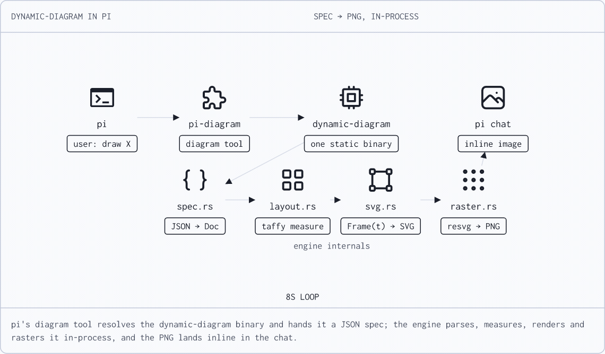

# dynamic-diagram

Portable diagram/simulation engine (Rust). Two ways in:

1. **Declarative spec** — a JSON document describes the picture, render anywhere.
2. **Sims** — 28 reference animations (repo-local test corpus; not shipped in releases).



*Rendered by the engine itself ([spec](assets/how-it-works.json)): pi's `diagram`
tool hands a JSON spec to the binary, which parses, measures, renders and
rasters it in-process — the PNG lands inline in the chat.*

## Install

Prebuilt binaries (linux/macOS/Windows) are on
[GitHub Releases](https://github.com/tzssangglass/dynamic-diagram/releases):

```sh
# shell installer (linux/macOS):
curl --proto '=https' --tlsv1.2 -LsSf https://github.com/tzssangglass/dynamic-diagram/releases/latest/download/dynamic-diagram-installer.sh | sh

# PowerShell (Windows):
irm https://github.com/tzssangglass/dynamic-diagram/releases/latest/download/dynamic-diagram-installer.ps1 | iex

# via cargo, prebuilt (no compile):
cargo binstall dynamic-diagram

# via cargo, from source:
cargo install --locked dynamic-diagram
```

Also on npm (`npm install -g dynamic-diagram`) and Homebrew
(`brew install tzssangglass/tap/dynamic-diagram`).

## The spec format (`dynamic-diagram spec <file.json> [svg|png|kitty]`)

```json
{
  "header": "MY NETWORK ·· OVERVIEW",
  "layout": "flow",
  "nodes": [
    { "id": "laptop", "label": "your laptop", "icon": "laptop" },
    { "id": "fw", "label": "firewall", "icon": "firewall" },
    { "id": "db", "label": "primary db", "icon": "database", "status": "10.0.0.5:5432" }
  ],
  "links": [
    { "from": "laptop", "to": "fw", "arrow": "end" },
    { "from": "fw", "to": "db", "arrow": "both" }
  ],
  "packets": [ { "label": "GET /api", "from": "laptop", "to": "fw", "progress": 0.5 } ],
  "texts":   [ { "text": "dmz", "x": 43, "y": 68, "dim": true } ],
  "badge": "live",
  "note": "caption line at the bottom"
}
```

`layout` selects measured `flow`, `grid`, or `columns` placement without node
coordinates. Existing fixed-coordinate specs use 0..100 scene space.
`status` is a badge under a node; `arrow` is `"end"` or `"both"`.
See `examples/network.json` and `examples/auto-layout.json`.

Presentation defaults to 75% of the logical canvas size, uniformly scaling
text, icons, routes and spacing. Canvas height follows content.
`canvas.min_height` adds space, while
`canvas.scale` enlarges the complete presentation without changing layout:

```sh
dynamic-diagram spec examples/auto-layout.json png --height 660
dynamic-diagram spec examples/auto-layout.json png --scale 2 --density 2
```

`canvas.scale` / `--scale` multiply this baseline; `--scale 1.3333333333333333`
restores the previous size. `--density` controls raster resolution independently.
Kitty playback and pi inline animation apply the same presentation factor to
viewport fitting, capped by the available space. Other image viewers (including
pi's native static-image viewer) may fit images to their own viewport.

### Icons

1. **Material Symbols — the FULL library: 3,912 filled icons** (embedded path
   data, Apache 2.0, from npm @material-symbols/svg-400). Router, dns, cell_tower,
   heat_pump, cyclone, volcano, skull — every symbol Google ships.
   `dynamic-diagram spec --list-icons` prints the available names.
   Aliases: `server→dns, phone/client→smartphone, tower→cell_tower,
   switch→settings_ethernet, firewall→security, database/db→storage,` etc.
2. **Flowchart/graphviz shapes** (semantic, not pictorial):
   `box, cylinder, ellipse/oval/circle, diamond, hexagon, stadium/pill,
   triangle, subroutine`.
3. Tabler stroke icons (`ti/…`) and official cloud icons (`aws/…`, `azure/…`,
   `gcp/…`, `cf/…`). Unknown names produce a visible dashed placeholder.

## Architecture

```
timeline docs (repo-local sims/*.json) ─┐
spec JSON (v1 sugar) ───────────────────────────┼─→ Doc ─→ prepared layout
                                                        + Frame(t) ─→ SVG ─┬─→ browser
                                                                          ├─→ PNG (resvg)
                                                                          └─→ kitty protocol
```

- **One universal mechanism**: a scene is elements whose properties are
  time-lines (constants or keyframes; numbers lerp, strings step). `frame_at(t)`
  resolves a doc into a static Frame — no per-animation code anywhere.
- The 28 network sims (TCP handshake, DNS, QUIC, BGP, …) are pure data in
  `sims/`, a repo-local corpus loaded at runtime (regression fixtures for
  `check`; not shipped in releases).
- Taffy composes measured node boxes and page bands. `src/layout.rs` owns
  geometry and theme metrics; `src/typography.rs` shares fonts with resvg.
- `src/svg.rs::Renderer` prepares stable document geometry once. Rasterization
  reuses its pixel buffer and caches identical SVG frames within 16 MiB/64
  entries. Fresh animation frames still require resvg parsing/rasterization.

## Run

```bash
mise use rust
cargo build --release
./target/release/dynamic-diagram spec examples/network.json        # → examples/network.png
./target/release/dynamic-diagram spec examples/network.json svg    # → stdout
./target/release/dynamic-diagram spec examples/network.json kitty  # → terminal
./target/release/dynamic-diagram spec examples/req-path.json       # animated example (has duration)
./target/release/dynamic-diagram            # browser sim player: localhost:8080
./target/release/dynamic-diagram kitty quic # terminal sim player (30fps)
./target/release/dynamic-diagram check      # correctness check, all sims
./target/release/dynamic-diagram skill      # print the agent authoring skill
```

## Sims (28) — data, not code

tcphs (default) · encap · arp · modem · vpn · ipbits · checksum · bgp · certchain ·
tcpvsudp · anycast · dialup · dh · routerhop · switchlearn · mtu · tls · tcpsim ·
igp · wdm · nat · dns · bandwidth · telegraph · netsim · msgjourney · linkclick · quic

Each is a timeline document in `sims/<name>.json` (repo-local, loaded at runtime) — the
**seed corpus**: regression fixtures for `check`, plus few-shot style
references for AI-generated animations. Not a coverage library: the mechanism
is the product, `anim` verbs + keyframes scale it (see
`outputs/sim-library-strategy.md` for the survey behind this positioning).
Timing, captions and world-coordinate intent remain in the source documents;
the renderer measures their presentation and reserves space for their content.

Icon data © Google, Apache 2.0 (src/assets/icons.rs).

## AI agent integration

The engine is agent-agnostic: it's a CLI with a JSON contract, so any agent
(pi, Claude Code, Codex, …) can render diagrams by writing a spec and running
the binary.

1. **Put the binary on PATH** — `ln -s $PWD/target/release/dynamic-diagram
   ~/.local/bin/` (or export `DYNAMIC_DIAGRAM_BIN`).
2. **Expose the skill to the agent:**
   - pi: `cp -r skills/dynamic-diagram ~/.pi/agent/skills/`
     (or via the [pi-diagram](https://github.com/tzssangglass/pi-diagram) extension, which also registers
     a `diagram` tool)
   - Claude Code: copy into the project's `.claude/skills/`, or work inside
     this repo — `CLAUDE.md` imports `AGENTS.md`
   - Codex and others: `AGENTS.md` at the repo root is picked up
     automatically; point other projects at `skills/dynamic-diagram/SKILL.md`
3. **Self-ingest anywhere:** `dynamic-diagram skill` prints the authoring
   skill — an agent that has never seen this repo can render diagrams after
   reading one command's output.

Authoring steps, geometry rules, and icon tiers are in
`skills/dynamic-diagram/SKILL.md` — print it anywhere with `dynamic-diagram skill`. The [pi-diagram](https://github.com/tzssangglass/pi-diagram) extension embeds the compact spec doc in its tool description,
so LLMs using that tool need no other files.
