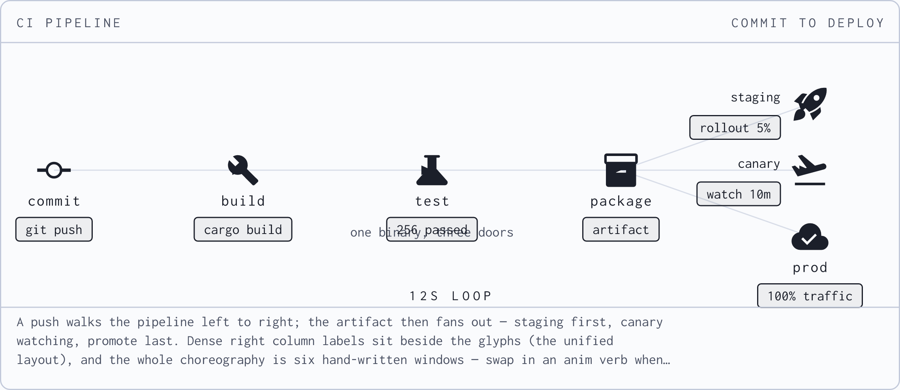
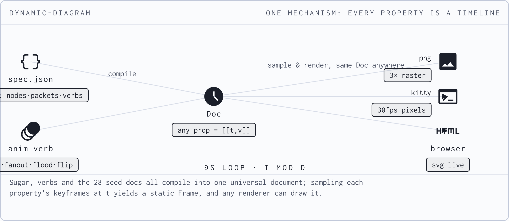
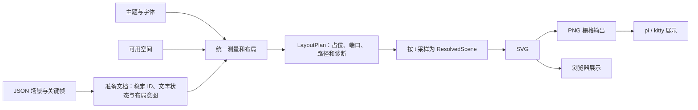

# 当前实现分析：统一布局、可扩展画幅与性能

后续实现已完成，最新结果、图片和测试见 [实现验收](unified-layout/RESULTS.md)。
下文保留改造前的分析与基线，不能作为当前实现状态。

基线：`ad20a6f`。继续分析 pi 会话 `01a0afb6-c0fc-7091-b033-5a0ccfac2037`；依据当前源码、该会话保留的 JSON、重新生成的 PNG 和本机 release 测量。本次产物是分析、方案和可复现证据，不包含引擎或 pi 扩展的实现改造。

**需求更新（2026-09-20）：** 用户提供 CHECKOUT API 的 scatter-gather 截图，将期望调整为“整体画幅再扩大 1 倍”，暂按目标 2× 记录。对应输入是 `.diagrams/scatter-gather.json`。截图中的卡片已接近窗口全宽，因此尚需区分“增加画布高度/排版空间”与“文字图标和整图一起放大到 2×，允许滚动/更大视图”。下文 1.5× 为上一轮方案示例与测量背景，不再作为最新目标上限；既有性能数字没有测量 2× 展示的端到端效果。

该截图还有可由源码解释的布局不一致：右列四个节点中心垂直间距为 43.2 逻辑单位，前三个节点触发侧置，最后一个仍下置。增大像素文件不会改变这个相对布局。最终方案应由完整节点尺寸和统一排列策略确定所需舞台高度，避免把截图专用高度或新的列数上限写成常量。

## 结论

**时间线已经统一，视觉布局还没有统一。** `Doc → frame_at(t) → Frame` 是值得保留的核心；当前 `Frame → SVG` 同时决定布局与绘图，承担过多隐含规则。最新 `plan_node_layout` 只处理一种局部冲突，无法支持“任意场景”的承诺。

推荐增加一个统一的布局模块：输入场景语义、主题和可用空间，输出已测量的矩形、文字基线、端口和路径。模块内部使用成熟盒布局器 Taffy，统一文字测量，并明确处理图连线、自由坐标、空间不足和跨帧稳定。SVG 渲染器消费这一结果，不再自行决定偏移和字号。

初轮 1.5 倍按“宽、高和文字图标一起放大，并受宿主可用空间约束”分析；当前目标更新与待确认含义见文首。展示放大、画布容纳更多内容、仅提高图片清晰度是三个不同能力。性能优化优先考虑像素预算、静态内容复用、动画帧采样和 pi 主线程阻塞。测量不支持先重写 keyframe 插值或批量消除 `clone()`。

## 上次会话完成了什么，遗漏了什么

会话把引擎与 pi 扩展拆成两个项目，把 28 个 sim 改成 timeline 文档，并加入 `seq/fanout/flood/flip` 编排动词。这些方向与通用机制的目标一致。

最后一次代码修复 `ad20a6f` 检测同列下方图标：空间不足时将 label/status 从下方翻到侧面，并修改 caption 换行和 v1/v2 入口。之后用户继续报告重影；会话末尾生成 CI 图，没有获得用户确认。截图中未观察到第二张卡片，不能证明图内部没有文字重叠。

本次重渲染保留输入，得到以下确定证据：

| 输入 | 当前输出的缺陷 | 证据 |
| --- | --- | --- |
| CI pipeline | `one binary, three doors` 与 `256 passed` 重叠 | usvg 实际文字包围盒分别为 `[295.80,189.85,433.80,202.44]` 与 `[334.80,187.69,394.80,200.28]`，二者相交 |
| CI pipeline | `prod` 的 `100% traffic` 框跨过 caption 分隔线 | `y=76` 对应中心 `200.16`；状态框范围 `240.16..260.16`，分隔线在 `260`；PNG 可见相压 |
| mechanism | 左列两段状态文字越出画布 | usvg 测得文字左边界分别为 `-32.40`、`-17.40`；画布左边界为 `0` |
| 无空格长 caption | 200 个 `W` 被保留在同一行，超过 92 字符预算 | `wrap()` 遇到找不到空格的分支，将整个剩余字符串放入一行 |





前两类图片均由本次 `cargo build --release` 后的二进制生成并人工查看。几何探针使用实际 usvg 字体解析结果；这是行/文字包围盒，不是每个字形的紧致可见轮廓。它足以证实以上问题，但不等于完整的碰撞验证器。没有在活跃 pi 窗口中测量瞬时重影、终端传输或 GPU 资源，因此不宣称定位了所有终端问题。

## 尺寸与位置为何仍然是局部规则

| 位置 | 当前逻辑 | 应由谁统一负责 |
| --- | --- | --- |
| `src/svg.rs:7–24` | `760×330`、header `36`、stage `216`；归一化坐标映射 | 页面布局和场景变换 |
| `src/svg.rs:38–75` | 图标半径 `17`、文字偏移 `30`、状态偏移 `40`；邻居阈值 `51/120/44/140` | 真实复合节点占位与布局约束 |
| `src/svg.rs:153–197` | 各图标目标大小；状态宽度按字数乘 `6` | 图标适配器与文字测量 |
| `src/svg.rs:210–238` | caption 按固定字符数换行、最多三行 | 可用宽度、字体、换行与溢出策略 |
| `src/svg.rs:343–452` | packet 隐藏阈值、节点字号/偏移、底栏分隔线 | 已解析场景几何与样式 |
| `src/main.rs:783–788` | `DDA_SCALE` 默认 `3`，直接扩大 pixmap | 输出采样配置 |
| `src/main.rs:798–844` | 终端格子比例假设 `0.5`；浏览器显示上限 `760px` | 展示端的 viewport 适配 |
| `../pi-diagram/extensions/index.ts:123` | 动画 `maxWidthCells: 84` | pi 宿主的可用宽度与展示配置 |

还有两个实质问题：

- 同一类 node 在下置时使用 `13px + 1.04` 字距，侧置时使用 `12px` 且无该字距。字体家族统一并不代表视觉排版统一。
- 连线仍从节点中心连到中心；packet 按中心点之间的直线插值，固定隐藏头尾 `2%`。这个百分比不考虑路径长度和节点/packet 的实际宽度，不能保证端点附近不重叠。

现有布局检查也复制了估算：label 固定按 `80/60` 宽检查，侧置 badge 的测试位置为 `y+8`，渲染器却使用 `y+10`。检查只覆盖几个短标签节点，不包括自由文本、路径、caption 和画布边界。应让检查与 renderer 共同消费同一个已测量几何结果，另以真实渲染验证测量一致性。

“没有硬编码”应落实为：布局数值来自主题、内容测量、约束或统一变换。主题默认字号、SVG 图标原始 `960/24` 网格、用户有意表达的地图坐标仍是合法数据；把每个 `+30` 改名成常量而保持现有决策方式，不能达成目标。

## 推荐机制及接口



对调用方保留小接口，例如“准备场景”与“采样/渲染指定时间”；文字测量、Taffy 树、缓存失效和路由都在布局模块内部。建议的 `LayoutPlan`、`ResolvedScene` 是新设计名，当前仓库尚不存在。

1. **测量。** 同一个字体选择、fallback、字号、字距和宽度约束同时服务布局与绘制。输出文字行盒、基线、advance 与可见边界；badge/packet 的宽高由内容加 padding 得出。caption 按实际宽度换行，并明确无空格 token、CJK、缺字、最大行数的策略。
2. **盒布局。** Taffy 负责页面的 header/stage/caption、复合 node 和 flow/grid/group。label/status 成为同一个节点的子盒；页面为实际 caption 高度分配空间，不让作者记住 `y≤75`。主题里统一字号、字距、图标盒、间距和描边。
3. **场景几何。** 端口从节点边界计算；边与 packet 共享同一条路径。标注绑定到节点、边或容器，避免没有归属的绝对位置。支持自由位置时，把完整节点、文字、说明栏、边都纳入统一诊断。
4. **稳定动画。** 当前 `Frame` 丢失节点 ID，packet 在 v1 编译时把端点烘焙成绝对坐标。布局模块需要保留稳定 ID、端口和路径引用，并在文档准备时分析各阶段文字状态的尺寸包络。文字变化不应导致节点每帧左右翻转；阶段切换的布局变化可以预计算为 keyframes，继续满足纯数据规则。随机访问 `frame_at(t)` 必须与顺序播放一致，不能隐含依赖上一帧。
5. **冲突策略。** 能重排的内容按声明的 flow/grid/graph 约束处理；固定坐标模式保留作者的空间意图。空间不足时按允许的策略增大逻辑画布、换行、调整布局或返回指向元素的诊断。任意密度的固定坐标不可能保证有限画布内永不相交。

Taffy 提供 Rust 的盒布局、树与 measure callback，但不提供文字排版、图拓扑布局、任意边路由或动画稳定性。选它是因为与当前单 Rust binary 约束契合，不是声称加一个依赖就能解决全部问题。[Taffy 官方文档](https://docs.rs/taffy/0.14.0/taffy/)

三个方案的比较：

| 方案 | 评价 |
| --- | --- |
| 继续集中常量并扩展当前左右翻转规则 | 改动少，但仍需要不断补充特殊规则，无法作为目标架构 |
| **Taffy + 统一文字测量和场景几何** | 推荐；通用盒布局复用成熟实现，图语义和动画契约由本项目明确负责 |
| Graphviz/ELK 主导拓扑布局，再配盒布局 | 任意关系图的摆放与路由能力更完整，分发和字体/尺寸适配更复杂；可优先作为生成阶段的图布局适配器 |

Graphviz 支持布局库接口，不能简单说它一定需要外部进程；ELK/elkjs 分别有 Java/JavaScript 集成成本。完整官方来源与能力边界见[布局引擎调研](layout-engine-research.md)。新 scene 仍然只是数据，不增加 DNS、CI 或其他领域专属 Rust。

## 1.5 倍应覆盖整条展示链

建议统一三个量：

- `logical_size`：内容排版所用空间，改变它会触发布局。
- `presentation_scale`：用户看到的整体倍率，同时缩放文字、图标、线宽与留白。
- `raster_density`：每个显示单位的采样密度，只影响位图清晰度/成本。

`display_size = logical_size × presentation_scale`；`raster_pixels = ceil(display_size × raster_density)`。

按当前基线举例，展示倍率 `1.5` 对应目标显示尺寸 `1140×495`；`viewBox` 可继续为 `760×330`。这个例子不要求把两个尺寸重新写死在所有后端。逻辑坐标与 viewport 的映射应遵守 SVG 的统一缩放规则。[SVG 2 坐标规范](https://www.w3.org/TR/SVG2/coords.html#ViewBoxAttribute)

pi 的 `84` 列上限、浏览器 `760px` 上限、kitty 的 `c/r` 都必须消费同一展示结果。`84→126` 仅是足够宽窗口下的验收例子，不能成为另一条硬编码。实际显示还要按可用宽高和终端格子尺寸等比 fit，必要时报告实际倍率/提供更大视图；宿主窗口不足时不能保证物理放大 1.5 倍。

只改 `DDA_SCALE=4.5` 会得到更大的像素文件，pi 仍可把它缩回相同的 84 列。纯整体缩放也保留所有原有重叠。统一布局与整体缩放需要分别验收。

## 性能测量与优先级

环境：AMD Ryzen AI 9 HX PRO 370，`rustc 1.98.1`，当前 release 依赖。分段探针直接引用本仓库 `frame/timeline/spec/svg/kitty/assets` 源码模块，采用相同字体和 resvg 渲染流程；每个配置预热 8 次，测 96 次，循环取 24 个时间点。计时不含进程启动、终端传输、磁盘输出、字体初始化、pixmap 初次分配和采样终点后的析构。它是阶段定位工具，不是终端端到端 FPS 测试。

| 场景 | 有效栅格倍率 | 像素尺寸 | 单帧 p50 | p95 | RGBA 缓冲 |
| --- | ---: | --- | ---: | ---: | ---: |
| CI | 2 | 1520×660 | 6.08 ms | 6.40 ms | 3.83 MiB |
| CI | 3 | 2280×990 | 9.47 ms | 10.75 ms | 8.61 MiB |
| CI | 4.5 | 3420×1485 | 17.52 ms | 20.01 ms | 19.37 MiB |
| mechanism | 2 | 1520×660 | 6.84 ms | 7.93 ms | 3.83 MiB |
| mechanism | 3 | 2280×990 | 11.95 ms | 13.21 ms | 8.61 MiB |
| mechanism | 4.5 | 3420×1485 | 22.03 ms | 24.20 ms | 19.37 MiB |

CI 图 3× 配置的阶段均值：

| 阶段 | 时间 | 约占总时间 |
| --- | ---: | ---: |
| `frame_at` | 0.008 ms | 0.08% |
| SVG 生成（含当前布局） | 0.038 ms | 0.39% |
| usvg 解析/文字处理 | 1.482 ms | 15.37% |
| raster | 4.996 ms | 51.82% |
| PNG encode | 2.817 ms | 29.22% |
| base64 | 0.299 ms | 3.11% |

另用真实 CLI 导出 CI 的 24 帧，含进程启动和写文件，6 次执行中取后 5 次中位数：2× 为 **162 ms**，3× 为 **264 ms**，4.5× 为 **426 ms**。缓存未清空，不能称为冷启动磁盘测量。扩大宽高 1.5 倍使像素/单个 RGBA 缓冲增加 **2.25 倍**；耗时增加幅度由实际阶段占比决定，不等于固定 2.25 倍。

这些数据支持以下顺序：

1. **先解决展示端的工作量和阻塞。** pi 当前先同步生成静态 PNG，再同步导出 24 帧，`spawnSync` 会阻塞调用线程。可改成异步子进程，并在合适条件下复用首帧。播放时每次读取文件、编码 base64、创建 `Image`；可按资源预算缓存编码帧，并按组件生命周期和可见性安排刷新。具体 TUI CPU/资源收益尚未测量；必须保留图像变化能触发 TUI 更新的契约，不能直接恢复上次已踩过的固定 image ID 行为。
2. **独立解决流畅度。** pi 固定采样 24 帧，所以 9 秒图约 2.67 fps、12 秒图约 2 fps。引擎 `kitty-anim` 又固定 12 帧，`kitty` 路径才以约 30 fps 为目标，web 刷新为 10 Hz。应统一以目标 fps/质量预算计算帧数，明确内存和首帧延迟；长动画适合流式渲染或有界缓存，不能不加限制地预渲染所有帧。计时应根据单调时钟而非只递增帧号，以免延迟累计。
3. **按实际显示尺寸生成足够像素。** 目前 pi 使用 2×，静态默认 3×。应从展示尺寸与质量要求推导密度。增加 1.5 倍展示后，维持相同显示采样质量会提高有效倍率；不能通过暗降画质宣称同质量加速。
4. **减少重复的静态渲染和 SVG 解析。** 缓存字体测量、图标解析和布局计划；逐步验证可复用的静态渲染层。当前图层次序是背景/线/packet/node 等，缓存不能改变遮挡与透明度；不能简单把所有静态对象压成背景再把 packet 画到最上层。PNG 编码是否需要调整，要同时比较耗时和输出字节。
5. **最后才考虑并行和微优化。** `fontdb`、图标表、pixmap 缓存已经存在。当前 `shared_render` 在全局 Mutex 内执行 render 与 encode，直接加线程仍会串行；需要有界 worker 和每 worker 缓冲，并评估放大后的内存成本。当前节点规划为 O(N²)，大量节点确需准备阶段布局/索引，但两张图的热路径证据不支持先围绕 HashMap、插值或零散 `clone()` 优化。

建议验收指标：分别记录布局准备、首个可见帧、循环帧 p50/p95、实际播放 fps、输出字节、峰值内存和 pi 主线程最长阻塞。30 fps 的整帧预算是约 33.3 ms，包含终端/宿主开销；上述仅 Rust 阶段低于预算不能证明终端已经达到 30 fps。优化前后应在同场景、同分辨率、同字体和同时间点下比较，不预先承诺倍数收益。

## 建议的实施批次与验收

| 批次 | 交付 | 验收重点 |
| --- | --- | --- |
| 1 | 统一文字/主题/几何结果；Taffy 页面与节点复合布局；布局诊断 | 两个原始失败输入；长文本/CJK/无空格 token；边缘、密集行列、caption；实际测量与 PNG 一致 |
| 2 | 稳定布局计划、端口/路径引用；flow/grid/groups 与显式坐标契约 | packet 与边共享路径；相同 t 不依赖播放顺序；全阶段状态不造成跳位；保留纯 keyframes |
| 3 | logical/presentation/density 配置贯通 CLI、浏览器、kitty、pi | 1.0/1.5 两种倍率；宽窄窗口；整体比例一致；有效尺寸可检查 |
| 4 | 可量化的缓存、异步生成和播放预算优化 | 相同画质/分辨率的阶段对比；1.5 倍后仍满足选定预算；无额外重复卡片/滚动退化 |

所有批次继续运行 28 个 sim 的既有 `check`；视觉验收需要覆盖状态切换前后、移动中间帧及边缘案例。原来的输出可以作为对照，但错误重叠不应作为必须保留的像素基准。同步更新 `docs/SPEC.md`、项目 authoring skill、pi 工具说明，让 AI 声明布局意图，而不是继续传授 `y≤75` 之类补偿规则。

## 验证状态、复现与使用的 skills

- `cargo build --release`：成功，构建输出无警告。
- `./target/release/dynamic-diagram check`：`check ok`。
- `cargo test --release`：成功，但实际运行 **0 个 Rust tests**；`examples/bisect.rs` 有两条既存警告。不能据此声称全仓库零警告或已有全面测试。
- 新的真实文字几何探针：两个输入均暴露缺陷，作为当前基线应失败。

```sh
cargo build --release
python3 outputs/layout-performance-audit/reproduce.py --assert-layout
# 当前基线：退出 1，列出真实文字重叠/越界。

python3 outputs/layout-performance-audit/reproduce.py --bench
# 输出几何诊断及各配置阶段测量；时间会随机器负载变化。
```

证据目录：[输入、PNG、测量原始数据与诊断源码](layout-performance-audit/)。配置记录见 [environment.json](layout-performance-audit/environment.json)，分段数据见 [stage-benchmarks.json](layout-performance-audit/stage-benchmarks.json)，CLI 数据见 [cli-benchmarks.json](layout-performance-audit/cli-benchmarks.json)。诊断源码复用生产模块，但不改变生产实现；不是提议的新渲染器，也不是完整性能基准框架。

本次读取并应用 find-skills（搜索与筛选）、codebase-design（模块接口）、brainstorming（架构方案）、research（官方资料后台调研）、项目 dynamic-diagram skill（渲染与检查）、verification-before-completion（结论验证）。外部技能搜索命中 `actionbook/rust-skills/m10-performance`，CLI 显示约 3.1K installs，源仓库页面约 1.5K stars；已读取其 SKILL.md，采用先测量再优化的流程，没有安装整个插件。[技能入口](https://skills.sh/actionbook/rust-skills/m10-performance)、[源仓库](https://github.com/actionbook/rust-skills)、[实际读取的 SKILL.md](https://github.com/actionbook/rust-skills/blob/main/skills/m10-performance/SKILL.md)
